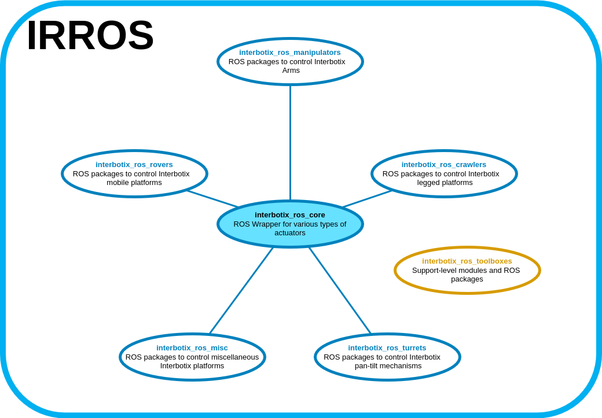
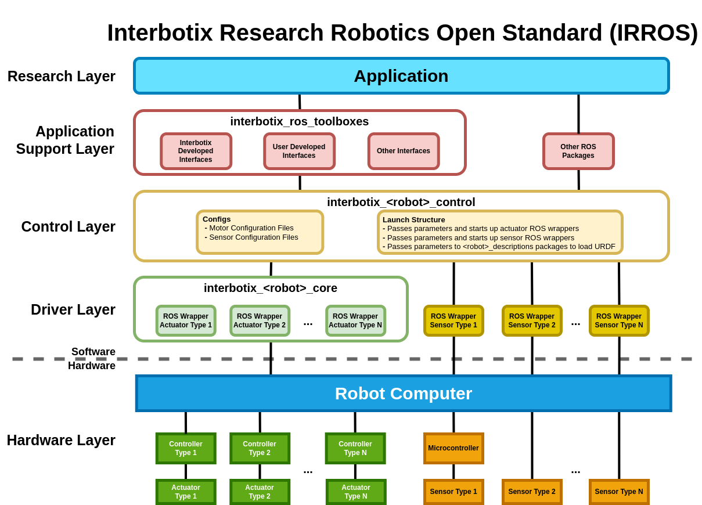

## Overview

Welcome to the *interbotix_ros_core* repository! This repo contains custom ROS Wrappers around the various types of actuators that we use at [Interbotix](https://www.trossenrobotics.com/). These ROS packages (one for each actuator) then provide the building blocks necessary to program our robots - no matter if they are 6-dof arms, pan-tilt mechanisms, hexapods, rovers, or a combination thereof (as the figure above should make clear).

Links to the various repositories that build up from this one include:
- [interbotix_ros_turrets](https://github.com/Interbotix/interbotix_ros_turrets)
- [interbotix_ros_rovers](https://github.com/Interbotix/interbotix_ros_rovers)
- [interbotix_ros_crawlers](https://github.com/Interbotix/interbotix_ros_crawlers)
- [interbotix_ros_manipulators](https://github.com/Interbotix/interbotix_ros_manipulators)

Coming soon...
- [interbotix_ros_misc](https://github.com/Interbotix/interbotix_ros_misc)

Support-level software can be found in the [interbotix_ros_toolboxes](https://github.com/Interbotix/interbotix_ros_toolboxes) repository

## Repo Structure
```
GitHub Landing Page: Explains repository structure and contains a single directory for each type of actuator.
├── Actuator Type X Landing Page: Contains the ROS Wrapper and any dependencies needed to make Actuator Type X work.
│   ├── Dependency 1: Low-level non-ROS code
│   ├── Dependency 2: Low-level ROS package
│   ├── Dependency X: More low-level code if needed
│   └── ROS Wrapper: Contains the ROS driver code needed to control the physical motor and explains the available ROS interfaces.
├── LICENSE
└── README.md
```
As shown above, there are three main levels to this repository. Over time, the repo will grow to include more types of actuators.

## Code Structure

To make the lower-level actuator ROS wrappers able to be easily integrated into our higher-level code, we have developed an intuitive approach called the **I**nterbotix **R**esearch **R**obotics **O**pen **S**tandard (IRROS). Every repository that builds on top of this one contains a chart similar to the above generic one - but filled in with the specifics for each robot. There are five main layers that are described below.

##### Hardware Layer
This describes the physical setup of the robot - specifically what actuators and/or sensors are plugged in to the robot computer. The computer could be an Intel NUC, laptop, Raspberry Pi, or something else - as long as it's capable of running ROS. Below the 'Robot Computer' (on the left side) are the actuator interface, controller, or driver boards followed by the physical motors. This could be a U2D2 or Arbotix board that controls Dynamixel servos or an Arduino that controls a motor driver that drives some hobby servos. Below the 'Robot Computer' (on the right side) are the sensor devices. This could be an Arduino hooked up to some force sensing resistors, switches, or potentiometers, or a RealSense camera.

##### Driver Layer
The first software layer contains the ROS wrappers for both the actuators and sensors plugged into the computer. These wrappers provide ROS interfaces to set or get data to/from the physical actuators or sensors. It essentially abstracts away all the lower-level 'plumbing' code (like serial protocols, register addresses, etc...) so that it's easy for a ROS researcher to get started on their project. As shown in the diagram, the *interbotix_ros_core* repo falls in this layer. To be clear though, third-party actuator or sensor ROS wrappers (ex. around the [Kobuki platform](http://wiki.ros.org/kobuki) or [RealSense camera](https://github.com/IntelRealSense/realsense-ros) devices) also fall in this layer.

##### Control Layer
The second software layer is a ROS package that exists for every genre of robot platform sold at Interbotix and lives in the various repos that build up from this one. It follows the naming convention *interbotix_XXXXX_control* where *XXXXX* is replaced with the name of the robot platform. For example, in the [X-Series Arms](https://github.com/Interbotix/interbotix_ros_manipulators/tree/main/interbotix_ros_xsarms) directory located in the *interbotix_ros_manipulators* repo, we have the *interbotix_xsarm_control* ROS package. This can be understood as the ROS package that allows a user to easily control/configure any of the many X-Series arms that we sell. The two main components of the package are the 'config' directory and launch file. The 'config' directory stores YAML files that describe the parameters for all the actuators and sensors in the robot. The launch file is then responsible for passing those parameters to all the actuators/sensors in the robot and starting them up as well. In this manner, a ROS researcher only has to call one launch file to start a robot instead of multiple to start every actuator/sensor separately.

##### Application Support Layer
The third software layer is optional and only exists to provide Python modules or 'support-level' ROS packages to make it easier for a researcher to work with the robot on a higher level. The main home for this type of code is in the *interbotix_ros_toolboxes* repository. For example, this is where all the Python modules used to control any of the robots (like inverse kinematics solvers, gripper controllers, hexapod walking-gait pattern generators, etc...) that build up from this repo live. That said, miscellaneous ROS packages like AR-tag detectors, 3D object pose estimators, and similar that sit between a sensor's ROS wrapper and the final application could be said to live here as well.

##### Research Layer
The final software layer is the layer at which an end user programs their own code - for manipulation, navigation, computer vision, machine learning or some other application. For example, all the ROS packages and Python scripts within the *interbotix_XXXXX_examples* directory (which exist in the repositories that build on-top of this one) could be described as 'application' layer code.

## Contributing
Feel free to send PRs to add features to currently existing Actuator ROS wrappers or to include a new one. Note that all PRs should follow the structure and naming conventions outlined in the repo including documentation.

## Contributors
- [Solomon Wiznitzer](https://github.com/swiz23) - **ROS Engineer**
