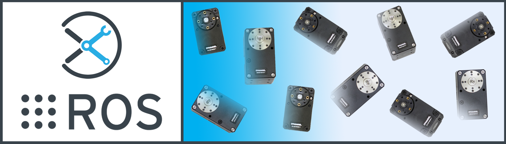

# Interbotix X-Series SDK ROS Package

## Overview
This package contains two driver nodes responsible for controlling the many X-Series platforms sold by Interbotix. Descriptions for both of them are below.

The first one is loosely based on the [dynamixel_workbench_controllers.cpp](https://github.com/ROBOTIS-GIT/dynamixel-workbench/blob/master/dynamixel_workbench_controllers/src/dynamixel_workbench_controllers.cpp) file created by [ROBOTIS](http://www.robotis.us/) to control a slew of their Dynamixel servo motors. Also written in C++, the node presents a ROS interface that is built on top of the [dynamixel_workbench_toolbox](https://github.com/ROBOTIS-GIT/dynamixel-workbench/tree/master/dynamixel_workbench_toolbox), a C++ library provided by ROBOTIS containing useful functions that utillize their communication protocol. Feel free to take a look at their [API](http://emanual.robotis.com/docs/en/software/dynamixel/dynamixel_workbench/#api-references) to get a better understanding of how their functions work. Also, take a look at the *interbotix_xs_sdk*'s header file [here](include/interbotix_xs_sdk/xs_sdk_obj.h) which contains the various ROS Publishers, Subscribers, Timers, etc... all fully documented. In general, there are two ways this node can be used. One is to command the robot via the ROS topics and/or services. In this manner, the developer can code in any language that is capable of sending a ROS message. The other approach is to 'skip' the ROS topic layer and use the publicly available functions directly. All the user would need to do is create an instance of the 'InterbotixRobotXS' class as shown [here](src/xs_sdk.cpp) to take advantage of these functions.

The second driver node is meant to simulate control of Dynamixel servos using Rviz. It contains the same ROS interfaces as the actual driver and can be used to 'test-out' code before working with the physical motors. All higher level code or ROS packages can stay exactly the same (no code needs to be changed to make them compatible with the simulator). It is written in Python, and the documented code can be found [here](scripts/xs_sdk_sim). It does have some limitations which are described in the 'Structure' section below.

## Structure

The *interbotix_xs_sdk* package contains the actual driver node called **xs_sdk** and a simulation node called **xs_sdk_sim**. As mentioned previously, these nodes are responsible for controlling the robot. Please look below for a description of the ROS topics, services, actions, and parameters available to the user. Note that the 'mode' and 'motor' config files referenced in some of the descriptions can be found in the 'config' directory of the *interbotix_XXXXX_control* package in any *interbotix_ros_XXXXX* repository. Templates, including parameter descriptions, can be found in the 'config' directory located [here](config/). Finally, if there is any difference between how the two nodes behave, that will be outlined below too.

##### Publishers
- `/<robot_name>/joint_states` - publishes ROS JointState messages at a user-desired frequency; note that in general, positions are given in radians, velocities are given in radians per second, and effort is given in milliamps. If the robot has a two-finger gripper, the positions for the 'right_finger' and 'left_finger' joints are given in meters relative to a virtual 'fingers_link' placed dead center (launch a robot model in Rviz to get familiar with the link and joint names/positions).

  **Simulation:** publishes ROS JointState messages at 20 Hz. Only the 'name' and 'position' fields in the messages are populated. Otherwise, it operates the same as the physical driver.

##### Subscribers
- `/<robot_name>/commands/joint_group` - subscribes to [JointGroupCommand](msg/JointGroupCommand.msg) messages; this topic is used to control a specified group of joints synchronously (which is more efficient than sending commands to individual joints consecutively). Refer to the message description for implementation details. Any number of joint groups can be defined in the motor config file.
- `/<robot_name>/commands/joint_single` - subscribes to [JointSingleCommand](msg/JointSingleCommand.msg) messages; this topic is used to control a single joint. Refer to the message description for implementation details.
- `/<robot_name>/commands/joint_trajectory` - subscribes to ROS [JointTrajectoryCommand](msg/JointTrajectoryCommand.msg) messages; this topic is used to send desired trajectories to a specified joint or joint group. Refer to the message description for implementation details.

  **Simulation:** All Subscription topics behave identically to the physical driver ones.

##### Services
- `/<robot_name>/torque_enable` - service to torque on/off the specified motor or motors; refer to the [TorqueEnable](srv/TorqueEnable.srv) service description for implementation details.

  **Simulation:** messages are displayed showing that the desired motors were torqued on/off, but nothing actually happens.

- `/<robot_name>/reboot_motors` - service to reboot the specified motor or motors; refer to the [Reboot](srv/Reboot.srv) service description for implementation details.

  **Simulation:** messages are displayed showing that the desired motors were rebooted, but nothing actually happens.

- `/<robot_name>/get_robot_info` - service to get robot information like joint limits, joint names, and joint 'sleep' positions; refer to the [RobotInfo](srv/RobotInfo.srv) service description for implementation details.
- `/<robot_name>/set_operating_modes` - service to set a motor's or multiple motors' operating modes (like position, velocity, current, etc...); refer to the [OperatingModes](srv/OperatingModes.srv) service description for implementation details. Note that the motors will torque off for a moment when changing operating modes so make sure that the robot is in its 'sleep' pose (defined in the motor config file) or otherwise secured before calling this service.

  **Simulation:** behaves exactly the same except setting the operating mode just changes how the desired motors will be simulated; of course, nothing is torqued off either. Note that 'current_based_position', 'ext_position', and 'position' are all treated equivalently. Similarly, 'pwm' and 'current' modes are also treated the same, and masses/inertias of links are NOT considered. Additionally, when in a 'position-type' mode, motors should be using the 'Time-based Profile' Drive Mode as the 'Profile_Velocity' register is used to determine how long a motion should take ('Profile Acceleration' is ignored).

- `/<robot_name>/set_motor_pid_gains` - service to set a motor's or multiple motors' internal PID gains for position/velocity control; refer to the [MotorGains](srv/MotorGains.srv) service description for implementation details.

  **Simulation:** doesn't affect anything; no messages are even displayed.

- `/<robot_name>/set_motor_registers` - service to set a motor's or multiple motors' register values at once for a user-provided register name; refer to the [RegisterValues](srv/RegisterValues.srv) service description for implementation details.

  **Simulation:** only works the same if setting the 'Profile_Velocity' or 'Profile_Acceleration' registers; otherwise, nothing happens.

- `/<robot_name>/get_motor_registers` - service to get a motor's or multiple motors' register values at once for a user-provided register name; refer to the [RegisterValues](srv/RegisterValues.srv) service description for implementation details.

  **Simulation:** only works the same if getting the 'Profile_Velocity' or 'Profile_Acceleration' registers; otherwise, an empty service message is returned.

##### Parameters

- `motor_configs` - the file path to the 'motor config' YAML file; refer to the [Motor Config Template](config/motor_configs_template.yaml) file for details.
- `mode_configs` - the file path to the 'mode config' YAML file; refer to the [Mode Config Template](config/mode_configs_template.yaml) file for details.
- `load_configs` - a boolean that specifies whether or not the initial register values (under the 'motors' heading) in a motor config file should be written to the motors; as the values being written are stored in each motor's EEPROM (which means the values are retained even after a power cycle), this can be set to 'false' after the first time using the robot. Setting to 'false' also shortens the node startup time by a few seconds and preserves the life of the EEPROM.

  **Simulation:** the `load_configs` parameter is unused.

## Usage

To comply with the IRROS standard, this package contains no launch or config files (to keep it robot agnostic). Either node within it is meant to be included in the launch file located in any *interbotix_XXXXX_control* package (and passed the robot-specific motor and mode config files). For optimal usability, a URDF should also be loaded to the parameter server so that the `get_robot_info` ROS service can get joint position and velocity limits.

## Notes

Please note that the nodes do NOT check joint limits. It is up to the user to make sure that joint limits are not violated (such as by using the limits defined in the URDF) and that motors do not collide with any obstacles.
